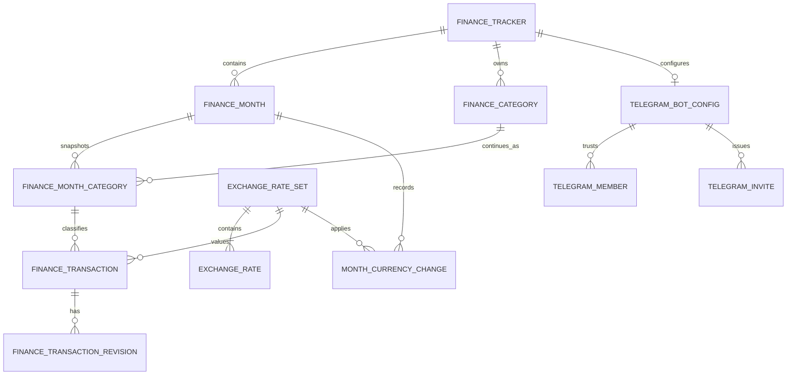

# Finance Tracker Architecture

Date: September 22, 2026

Status: design under review

## 1. Context

The finance tracker brings the behavior of a monthly budget spreadsheet into Personal Workspace
without reproducing a general-purpose spreadsheet engine. It maintains one aggregate balance,
monthly income and expense plans, actual transactions, soft limit visibility, and historical data
that can be recalculated in different currencies.

Telegram is the primary transaction-entry interface. The web application provides the current
month overview, configuration, corrections, audit access, and Telegram access management.

The expected data volume is small. The system is therefore designed as a relational module inside
the existing Personal Workspace modular monolith rather than as a separate service or analytical
platform.

## 2. Architectural decisions

- PostgreSQL is the source of truth for all confirmed financial data.
- A tracker has one aggregate balance. Accounts, wallets, and transfers do not exist in the model.
- A calendar month is the budgeting boundary and owns its display currency, opening balance, and
  category plan snapshots.
- Categories have stable identities across months, while their names and planned amounts are
  snapshotted per month.
- A category is permanently either `income` or `expense`.
- Transactions retain their original amount and currency and reference the exact historical
  exchange-rate snapshot used for valuation.
- The initial supported currencies are AMD, RUB, USD, and EUR.
- The first exchange-rate provider is the Bank of Russia. Rates are daily and checked every four
  hours.
- Transaction corrections use current-state rows plus immutable revisions and soft deletion.
- The current month is created lazily and atomically on first web access or first confirmed
  Telegram transaction.
- One Personal Workspace owner may connect multiple trusted Telegram users to the same tracker.
  Telegram participants have no roles and can only append transactions.
- Historical analytics remains a PostgreSQL read-model concern until measured scale justifies a
  different store.

The architecture intentionally excludes bank integrations, CSV or Excel imports, multiple
accounts, hard spending limits, user-defined currencies, event sourcing, and ClickHouse.

## 3. System structure

The feature follows the existing `personal-workspace` layer boundaries:

- `core.finance` owns domain schemas, enums, invariants, services, storage/client abstractions,
  exceptions, and concrete use cases. It has no Litestar, SQLAlchemy, Telegram, Valkey, or Bank of
  Russia dependencies.
- `infra.postgresql` owns SQLAlchemy models and implementations of finance storage abstractions.
- `infra.http` owns the Bank of Russia adapter behind a provider-neutral core client interface.
- `infra.valkey` owns temporary Telegram form state only.
- `entrypoints.litestar` exposes the protected finance API and the Telegram webhook.
- `entrypoints.taskiq` synchronizes exchange rates.
- `infra.ioc` wires adapters and use cases through Dishka.
- The sibling `frontend` repository owns the Angular workspace pages and navigation.

The web API and Telegram adapter call the same finance use cases. Transaction validation,
exchange-rate selection, month creation, and balance calculations are not implemented in transport
layers.

Valkey is not a financial data store. Losing Valkey may discard an unfinished Telegram form but
must not lose or duplicate a confirmed transaction.

## 4. Domain model and invariants

### 4.1. Tracker

A tracker belongs to exactly one Personal Workspace identity and contains all of that owner's
months, categories, transactions, and Telegram connections. The tracker has an explicit IANA time
zone used for month boundaries and exchange-rate dates.

### 4.2. Month

A month is a calendar month in the tracker's time zone. It contains:

- one display currency;
- one opening balance denominated in that currency;
- category plan snapshots denominated in that currency;
- transactions whose occurrence timestamps fall within the month.

Only the current month is exposed in the initial web interface, but completed months are not made
immutable at the domain or persistence level.

### 4.3. Category

A category has a stable identifier and immutable `income` or `expense` kind. Its monthly snapshot
contains the name, planned amount, display order, and whether it accepts new transactions.

Changing a monthly name or plan does not rewrite earlier snapshots. A stable category identifier
allows cross-month analytics to follow the same category through renames.

Archiving a category stops new transactions and prevents it from being copied into future months.
Existing monthly snapshots and transactions remain intact.

### 4.4. Transaction

A transaction has a positive amount. Its direction comes from the category kind rather than the
sign of the amount. The transaction stores:

- original amount and currency;
- actual occurrence timestamp;
- monthly category;
- optional description represented as a non-null string;
- creation source and author;
- the exchange-rate set applied to the occurrence date;
- a high-precision RUB reference value;
- optimistic version and soft-deletion state.

The occurrence timestamp must resolve to the transaction's month in the tracker time zone. The
creation timestamp is audit metadata and does not select the exchange rate.

### 4.5. Monthly calculations

All calculations exclude soft-deleted transactions.

```text
actual_income = sum(converted active income transactions)
actual_expense = sum(converted active expense transactions)

closing_balance = opening_balance + actual_income - actual_expense
net_savings = actual_income - actual_expense

expense_difference = planned_expense - actual_expense
income_difference = actual_income - planned_income
```

A negative expense difference indicates a soft-limit overrun. It never rejects a transaction.
Income plans are forecasts; expense plans are soft limits. There are no separate baseline, target,
or hard-limit entities.

## 5. Relational data model

The names below describe logical tables and do not prescribe final SQLAlchemy-generated table
names. Identifiers follow the repository's UUID conventions. Persisted timestamps use the
project-standard UTC-aware type.



### 5.1. `finance_tracker`

- `id`;
- unique `owner_username` corresponding to `core.identity.UserIdentity`;
- required IANA `timezone_name`;
- audit timestamps.

### 5.2. `finance_month`

- `id`, `tracker_id`;
- `period_start`, always the first day of the calendar month;
- `currency`;
- `opening_balance`;
- optional previous-month reference;
- copied closing-balance amount and currency used to initialize the month;
- optimistic `version`;
- audit timestamps.

`(tracker_id, period_start)` is unique.

The copied closing-balance snapshot is not a second balance. It records the transfer basis and
allows the system to detect that an earlier month was later corrected without silently cascading
changes through subsequent months.

### 5.3. `finance_category`

- `id`, `tracker_id`;
- immutable `kind` (`income` or `expense`);
- optional `archived_at`;
- creation timestamp.

### 5.4. `finance_month_category`

- `id`, `month_id`, `category_id`;
- snapshotted `kind`;
- `name` and normalized name;
- `planned_amount` in the month currency;
- `position`;
- `accepting_transactions`;
- optional source month-category reference;
- audit timestamps.

`(month_id, category_id)` is unique. Core rejects duplicate normalized names within one month and
category kind. The snapshotted kind makes historical reads self-contained while core enforces that
it matches the immutable category kind.

### 5.5. `finance_transaction`

- `id`, `month_id`, `month_category_id`;
- `original_amount`, `original_currency`;
- `amount_rub`;
- `exchange_rate_set_id`;
- `occurred_at`;
- non-null `description`;
- `source` (`web` or `telegram`);
- author type and identifier;
- optional Telegram callback/update identifier;
- optimistic `version`;
- `created_at`, `updated_at`, optional `deleted_at`.

The Telegram identifier has a partial uniqueness constraint for Telegram-created transactions so
that webhook retries cannot create duplicates.

The monetary basis changes only when the transaction's amount, original currency, or occurrence
date is explicitly edited. Changing the month display currency never rewrites it.

### 5.6. `finance_transaction_revision`

- `id`, `transaction_id`, sequential revision number;
- action (`update`, `delete`, or `restore`);
- complete previous-state snapshot with a snapshot schema version;
- actor and change timestamp.

The current transaction row is used for normal reads. Revisions are immutable audit snapshots, not
events from which current state must be rebuilt.

### 5.7. `finance_exchange_rate_set`

- `id`;
- provider identifier;
- `effective_on` and `fetched_at`;
- RUB base currency;
- source-payload hash;
- uniqueness across provider, effective date, and payload hash.

### 5.8. `finance_exchange_rate`

- `rate_set_id`, `currency`;
- provider `nominal`;
- normalized `rub_per_unit`;
- uniqueness of currency within a set.

Every set includes RUB with a nominal and value of one. Provider values quoted for multiple units,
such as 100 AMD, are normalized to one unit before persistence.

Rate sets are immutable. If the provider corrects a rate for the same effective date, a new set is
created. Existing transactions remain linked to the set originally applied.

### 5.9. `finance_month_currency_change`

- month reference;
- previous and new currency;
- applied rate-set reference and conversion factor;
- opening-balance and category-plan snapshots before and after conversion;
- actor and change timestamp.

A month currency change converts the opening balance and all category plans in one database
transaction. Original transaction amounts and their rate-set references remain unchanged.

### 5.10. Telegram tables

`finance_telegram_bot_config` stores one bot configuration per tracker: encrypted bot token,
enabled state, bot identity, webhook secret, and audit timestamps.

`finance_telegram_member` stores the bot configuration, numeric Telegram user ID, display-name
snapshot, join timestamp, and optional revocation timestamp. Telegram user ID, not display name,
is the trusted identity.

`finance_telegram_invite` stores a one-time invitation token hash, expiration, consumption
timestamp, and linked member. The raw token is shown only in the generated Telegram deep link and
is never persisted.

## 6. Money and exchange-rate architecture

Money and exchange-rate calculations use `Decimal` and PostgreSQL `NUMERIC`, never `float`.
Monetary values use `NUMERIC(30, 12)` and normalized rates use `NUMERIC(30, 18)`.

User input accepts two decimal places for RUB, USD, and EUR and whole units for AMD. Intermediate
calculations retain database precision. Presentation uses consistent `ROUND_HALF_UP` rounding to
two places for RUB, USD, and EUR and to a whole unit for AMD.

The Bank of Russia publishes values relative to RUB. The system therefore uses RUB as an internal
reference without making it the tracker or reporting currency.

```text
amount_rub =
    original_amount
    * rub_per_unit(original_currency, operation_rate_set)

amount_in(target_currency) =
    amount_rub
    / rub_per_unit(target_currency, operation_rate_set)

converted_month_value =
    old_value
    * rub_per_unit(old_month_currency, currency_change_rate_set)
    / rub_per_unit(new_month_currency, currency_change_rate_set)
```

Because each transaction references a complete immutable rate set, recalculating it in any of the
supported currencies requires no external provider call.

### 6.1. Rate selection

For an operation date, the rate resolver selects the latest persisted set whose `effective_on` is
not later than the local operation date. This naturally applies the most recent official rate on
weekends and holidays.

If no eligible set exists locally, the Bank of Russia adapter requests historical data and
persists an immutable set before the financial write begins. A provider request must not hold a
month or transaction database lock.

If the provider is unavailable, the latest eligible persisted set may still be used, retaining its
actual effective date. If no eligible set exists, the financial mutation fails without partial
writes.

TaskIQ checks current daily rates every four hours. Identical payloads do not produce duplicate
sets. A future provider adapter may replace or supplement the Bank of Russia adapter, but it may
not rewrite rate sets already referenced by transactions.

Adding another supported currency is a release-time schema and code change. Historical rate sets
required by existing transaction dates must be backfilled and validated before the currency is
enabled.

Official provider references:

- <https://www.cbr.ru/development/SXML/>;
- <https://www.cbr.ru/development/DWS/>;
- <https://www.cbr.ru/eng/currency_base/daily/>.

## 7. Month lifecycle

### 7.1. Initial month

The first month cannot be inferred from production defaults. Tracker initialization supplies an
explicit time zone, month currency, opening balance, and initial income and expense categories with
their planned amounts.

Until initialization completes, Telegram transaction creation is unavailable because there is no
valid month or category context.

### 7.2. Lazy month creation

The current month is created when the web application first requests it or a Telegram participant
first confirms a transaction after a month boundary. No midnight scheduler is required.

Creation runs as an idempotent transaction:

1. Resolve the current calendar month in the tracker time zone.
2. Lock month creation for the tracker and period.
3. Copy the previous month's currency.
4. Calculate and copy the previous month's closing balance.
5. Copy active categories, names, ordering, and planned amounts.
6. Persist the transferred closing-balance snapshot.
7. Rely on `(tracker_id, period_start)` uniqueness as the final race guard.

The same use case is called from the web and Telegram paths.

### 7.3. Historical corrections

Editing an earlier month does not automatically cascade through later opening balances. When a
recalculated closing balance differs from the snapshot used to initialize the following month, the
system exposes a mismatch.

An explicit synchronization operation replaces the following month's opening balance. If the two
months currently use different currencies, synchronization uses the rate set effective at the time
of synchronization and records the conversion in the audit trail.

## 8. Transaction mutation and audit

The web application may create, update, soft-delete, and restore transactions. Telegram may only
create a transaction after final confirmation.

Transaction creation validates ownership, month boundaries, category kind and availability,
positive amount, currency, input precision, and an eligible exchange-rate set.

Updating amount, original currency, or occurrence date selects a new applicable rate set and
recalculates `amount_rub`. Updating only category or description retains the previous monetary
basis. In both cases, the complete previous state is written to a revision before the current row
is changed.

Updates and deletions require the current optimistic version. A stale request fails with a conflict
rather than overwriting another change. Revision insertion and current-state mutation occur in the
same database transaction.

## 9. Telegram integration

### 9.1. Trust model

The tracker owner configures one Telegram bot and generates one-time invitation links. Opening a
valid invitation binds a Telegram user ID to the owner's tracker. The owner can revoke a binding
from the web application.

All active Telegram members have the same append-only capability. There are no participant roles.
The Personal Workspace owner boundary is used only to configure the bot and manage trust.

The webhook is an externally authenticated integration endpoint. It validates the per-bot webhook
secret before resolving a member or processing payload data. Bot tokens, webhook secrets, and raw
invitation tokens must never be logged.

### 9.2. Form state machine

The Telegram adapter implements a deterministic step-by-step state machine:

```text
kind -> category -> amount -> currency -> occurred_at -> description -> confirmation
```

The month currency is presented first at the currency step. The occurrence timestamp defaults to
the current time but may be selected within the current month. Description is optional. Final
confirmation is mandatory.

Draft state is stored in Valkey under bot configuration and Telegram user ID with an explicit TTL.
The final confirmation revalidates membership, current month, category availability, and rate
selection because those may have changed while the form was open.

The confirmed operation and its Telegram callback/update idempotency key are persisted atomically
in PostgreSQL. Telegram retries return the existing outcome or a safe no-op.

## 10. Entry points and authorization boundaries

Protected web capabilities are mounted under `/api/finance` and use the existing
`request.user.username` and `core.identity` boundary. Storage queries are always scoped by tracker
owner; possession of another entity's identifier is insufficient for access.

The protected API exposes domain-oriented operations rather than database-shaped CRUD:

- tracker initialization and current-month retrieval;
- idempotent current-month creation;
- month summary and transaction reads;
- monthly category and plan management;
- transaction mutation and revision reads;
- month-currency conversion;
- explicit opening-balance synchronization;
- Telegram configuration, invitations, members, and revocation.

The Telegram webhook does not use a web user session. It resolves the tracker only after validating
the bot configuration and trusted Telegram member, then invokes the same finance use cases used by
the protected API.

The Angular frontend treats backend calculations as authoritative. It does not maintain a separate
balance or currency-conversion implementation.

## 11. Consistency and concurrency

The following operations are atomic database transactions:

- lazy month creation with its opening balance and category snapshots;
- transaction creation with Telegram idempotency metadata when applicable;
- transaction mutation with its previous-state revision;
- month-currency conversion with opening-balance and plan updates;
- explicit opening-balance synchronization;
- invitation consumption with Telegram-member creation.

Month creation uses locking plus a unique database constraint. Transaction updates use optimistic
versions. Rate-set rows are immutable. These mechanisms prevent duplicate months, duplicate
Telegram transactions, lost transaction updates, and historical rate drift.

Closing balances and category actuals are derived from active transaction rows. They are not stored
as independent mutable aggregates. At the expected data volume, indexed PostgreSQL aggregation is
sufficient. The primary read indexes cover tracker/month, occurrence time, monthly category,
deletion state, and Telegram idempotency identifiers.

## 12. Failure handling

- A missing initial month prevents Telegram writes and requires tracker initialization through the
  protected web flow.
- A missing exchange rate with no available provider response aborts the financial mutation without
  partial data.
- A rate from an earlier business day is valid for weekends and holidays; its actual effective date
  remains visible in transaction details.
- If a category is archived while a Telegram form is open, final confirmation fails and the draft
  cannot create a transaction against it.
- If the calendar month changes while a Telegram form is open, the draft is invalidated rather than
  silently moved to the new month.
- A repeated Telegram webhook or callback does not create a second transaction.
- A stale web update produces a conflict rather than last-write-wins behavior.
- A rate synchronization failure is observable and retryable. Existing persisted rates continue to
  support reads and eligible writes.
- Losing Valkey expires drafts only; PostgreSQL-backed finance data remains intact.

## 13. Security and privacy

- Web access is scoped by `owner_username` in storage queries.
- Finance web routes are protected product routes.
- The Telegram webhook is authenticated with a per-bot secret before payload processing.
- Bot tokens are encrypted at rest through the existing cryptography boundary.
- Invitation tokens are cryptographically random, single-use, expiring, and stored only as hashes.
- Telegram numeric user IDs are identities; display names are untrusted labels.
- Revocation is checked again at final confirmation and invalidates any existing draft.
- Financial descriptions, full Telegram payloads, monetary values, and integration secrets are not
  emitted as raw log fields.
- Transaction creation and every subsequent revision retain their responsible actor.

## 14. Analytics extension

Historical analytics is a read-model extension over the same PostgreSQL data. A future
`reporting_currency` parameter changes presentation only and does not mutate month currencies.
Each transaction is converted through its own historical rate set.

Cross-month category analytics groups by stable `category_id`, so renames do not fragment the
series. Historical month-category snapshots retain the label and plan that were valid in each
period.

Sliding day, week, month, and year views aggregate actual transactions. Monthly plans apply to
calendar months and are not proportionally projected into arbitrary sliding windows.

Materialized aggregates or ClickHouse should be introduced only after measured query latency or
data volume demonstrates that indexed PostgreSQL aggregation is insufficient.
